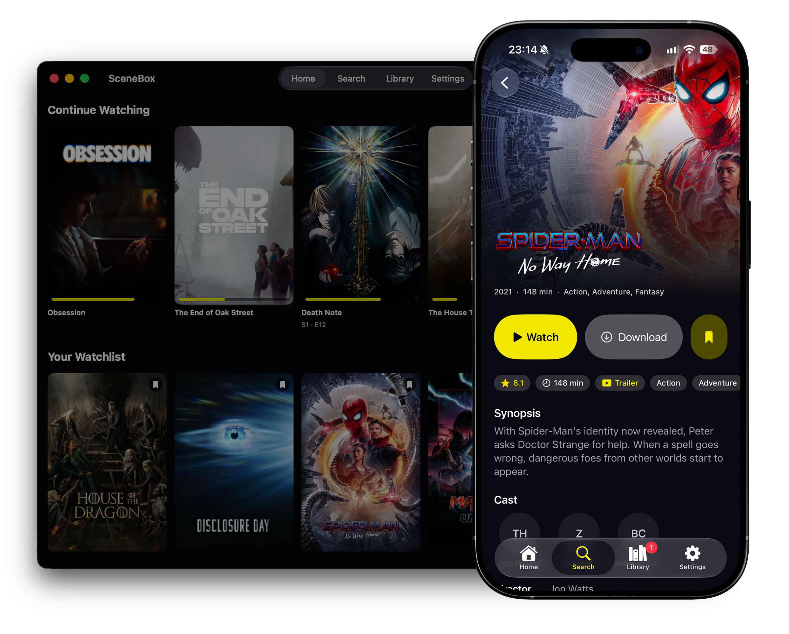

# SceneBox



Torrent streaming client for iOS, iPadOS, tvOS and Mac (Catalyst), written in SwiftUI.

Sources come from Stremio-compatible addons. Streams play through a vendored
libtorrent engine and a local HTTP server feeding VLC; debrid-cached releases
play directly over HTTPS.

## Project layout

- `WatchBox/App` – app entry, root navigation
- `WatchBox/Core/Catalog` – addon queries, release parsing, TMDB
- `WatchBox/Core/TorrentEngine` – libtorrent session and the local stream server
- `WatchBox/Features` – screens (Home, Search, Detail, Player, Library, Profiles, Downloads, Settings)
- `WatchBox/Shared` – models, UI components, theme
- `LibTorrent` – prebuilt `LibTorrentEngine.xcframework` (libtorrent 2.0.11 + OpenSSL) and its ObjC++ wrapper
- `scripts` – release packaging (`release-mac.sh`, `export-ipa.sh`)

## Building

To build this yourself you need:

1. Xcode 16 or later. Packages resolve on first open.
2. A Firebase project of your own. Download its `GoogleService-Info.plist` and
   put it at the repo root (it is not included in this repo). Enable
   Email/Password auth, Firestore and Storage in the Firebase console.
3. An Apple Developer account. Set `DEVELOPMENT_TEAM` in the project to your
   team for device builds, notarized Mac builds and signing.

The engine is prebuilt; Xcode links the xcframework and does not compile
`TorrentEngine.mm`. Rebuild scripts live in `~/libtorrent-build/`.

## Firebase

- Auth: email/password.
- Firestore: per-account profiles, each with its own watch progress and
  watchlist; debrid/TMDB keys synced under `users/{uid}/settings`.
- Storage: profile avatars.

Security rules restrict every client to its own `users/{uid}` subtree.

## Releases

```
scripts/release-mac.sh 1.0.0    # signed + notarized DMG
scripts/export-ipa.sh 1.0.0        # unsigned iOS IPA for sideloading
scripts/export-ipa.sh 1.0.0 tvos   # unsigned tvOS IPA for sideloading
```

## Debug flags

- `-WBAutoStreamMagnet '<magnet>'` – start a stream at launch
- `-WBAutoStreamFileIndex N` – pick a file inside a pack
- `-WBAutoSeekScript '40:+300,80:-120'` – scripted seeks

Metrics are written to `Documents/diagnostics/metrics.jsonl` in Debug builds.
